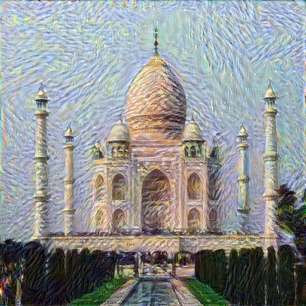

# Artistic Style Transfer using PyTorch

## Project Overview

This project implements **Neural Style Transfer**, a deep learning
technique that combines the content of one image with the artistic style
of another image using an optimization-based approach.

The objective is to generate a new image that:

-   Preserves the structural content of the original image
-   Adopts textures, colors, and artistic patterns from the style image

The implementation uses a pretrained **VGG19** convolutional neural
network as a fixed feature extractor.

------------------------------------------------------------------------

# Core Idea

Neural Style Transfer works by defining two types of losses:

-   **Content Loss**
-   **Style Loss**

The generated image is initialized either randomly or as a copy of the
content image and is iteratively updated to minimize the total loss.

Total Loss = Content Loss + Style Loss

------------------------------------------------------------------------

# Model Architecture and Layer Selection

A pretrained **VGG19** network is used as a fixed feature extractor.

-   Fully connected layers are removed (since this is not a
    classification task)
-   Only convolutional layers are used
-   The network weights are frozen
-   The generated image pixels are optimized instead

VGG19 consists of sequential convolutional blocks:

-   Convolution layers
-   ReLU activations
-   MaxPooling layers

As we move deeper into the network, feature representations become more
abstract.

------------------------------------------------------------------------

## Why Only Convolutional Layers?

Fully connected layers capture class-specific information for
classification tasks.

In style transfer, we are interested in:

-   Spatial feature maps
-   Texture representations
-   Structural patterns

Therefore, only convolutional layers are used.

------------------------------------------------------------------------

# Content Representation

Content is extracted from a deeper convolutional layer such as:

conv4_2

## Why Deeper Layers for Content?

Earlier layers capture: - Edges - Simple patterns - Local textures

Deeper layers capture: - Object structure - Spatial layout - High-level
semantic information

Using block5_conv2 ensures that:

-   Fine textures are ignored
-   Overall structure is preserved

Content loss is computed as the Mean Squared Error (MSE) between:

-   Feature maps of the content image
-   Feature maps of the generated image

------------------------------------------------------------------------

# Style Representation

Style is extracted from multiple layers:

    'block1_conv1',
    'block2_conv1',
    'block3_conv1',
    'block4_conv1',
    'block5_conv1'

## Why Multiple Layers?

Style exists at multiple scales:

-   Early layers → colors and edges
-   Middle layers → textures
-   Deeper layers → complex artistic patterns

Using multiple layers ensures:

-   Both fine and coarse textures are captured
-   Global artistic patterns are preserved

------------------------------------------------------------------------

# What is a Gram Matrix?

Style is represented using a **Gram Matrix**.

If a convolutional layer produces N feature maps, the Gram Matrix is an
N × N matrix where:

-   Each element represents the correlation between two feature maps

If F is reshaped to:

(number_of_filters × spatial_pixels)

Then:

G = F × Fᵀ

The Gram Matrix captures:

-   Texture patterns
-   Color distributions
-   Repetitive structures

------------------------------------------------------------------------

# Style Loss

Style loss is computed as the Mean Squared Error between:

-   Gram matrices of the style image
-   Gram matrices of the generated image

This is calculated across multiple selected layers.

------------------------------------------------------------------------

# Role of MaxPooling Layers

MaxPooling layers:

-   Reduce spatial dimensions
-   Increase receptive field size
-   Allow deeper layers to capture global structure

------------------------------------------------------------------------

# Optimization Process

1.  Load content and style images\
2.  Resize and normalize images\
3.  Pass images through VGG19\
4.  Extract feature maps\
5.  Compute content loss\
6.  Compute style loss using Gram matrices\
7.  Combine losses\
8.  Optimize the generated image using gradient descent

------------------------------------------------------------------------

# Tech Stack

-   Python\
-   PyTorch\
-   Torchvision\
-   PIL\
-   Matplotlib

------------------------------------------------------------------------

# Key Learnings

-   Understanding hierarchical feature representations in CNNs\
-   Difference between spatial structure and texture representation\
-   Role of Gram Matrix in capturing style\
-   Balancing content and style weights\
-   Optimization-based image generation

------------------------------------------------------------------------

# Output

## Content Image

## Style Image

## Generated Output

------------------------------------------------------------------------

# Possible Improvements

-   Implement Fast Style Transfer using feedforward networks\
-   Experiment with different style weights\
-   Use alternative pretrained backbones\
-   Deploy as a web application using FastAPI or Streamlit
